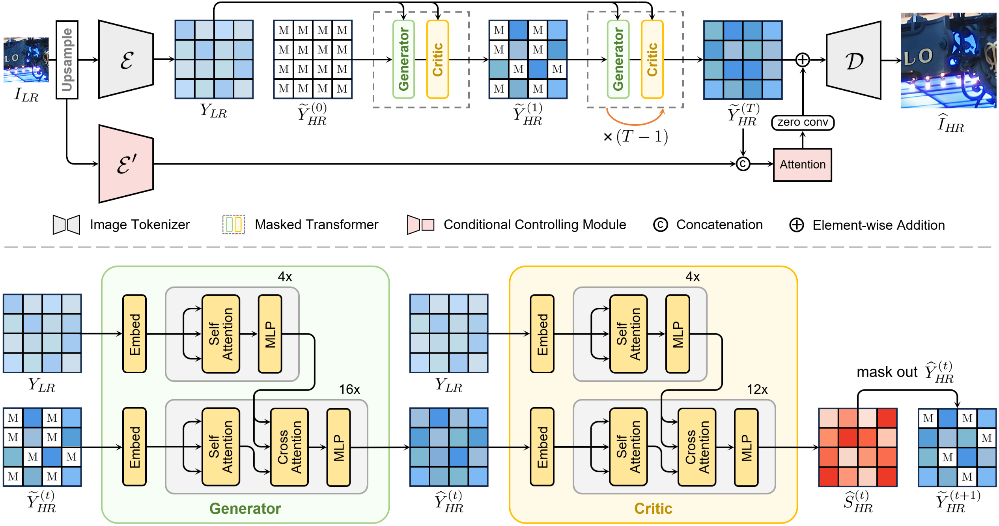

# RealSRT

[Paper](https://www.ecva.net/papers/eccv_2024/papers_ECCV/papers/08254.pdf) | [BibTex](https://github.com/USTC-JialunPeng/RealSRT#citing) 

PyTorch implementation of ECCV 2024 paper 
"Confidence-Based Iterative Generation for Real-World Image Super-Resolution"

## Introduction
<div align=center>

</div>

*Visualizations of our confidence-based iterative generation process for real-world SR.*

## Method
<div align=center>

</div>

*Overview of RealSRT.*


## Installation
Clone this repository：
```
git clone https://github.com/USTC-JialunPeng/RealSRT.git
```

## Citing
If our method is useful for your research, please consider citing.

```
@inproceedings{peng2024confidence,
  title={Confidence-Based Iterative Generation for Real-World Image Super-Resolution},
  author={Peng, Jialun and Luo, Xin and Fu, Jingjing and Liu, Dong},
  booktitle={European Conference on Computer Vision},
  year={2024}
}
```
