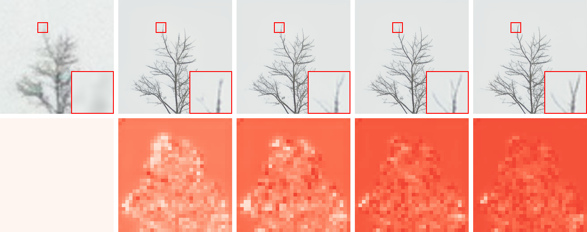

# RealSRT

[Paper](https://www.ecva.net/papers/eccv_2024/papers_ECCV/papers/08254.pdf) | [BibTex](https://github.com/USTC-JialunPeng/RealSRT#citing) 

PyTorch implementation of ECCV 2024 paper 
"Confidence-Based Iterative Generation for Real-World Image Super-Resolution"

## Introduction
<div align=center>

</div>

*Visualizations of our confidence-based iterative generation process for real-world SR. The iterative process leads to better perceptual quality and improved confidence scores across multiple steps. (Top) The LR input image and the generated HR images. (Bottom) The predicted confidence scores for HR tokens (darker denotes higher confidence scores).*

## Method
<div align=center>

</div>

*Overview of RealSRT. (Top) RealSRT consists of an image tokenizer, a masked transformer, and a conditional controlling module. The image tokenizer is a pre-trained VQGAN with an encoder $\mathcal{E}$ and a decoder $\mathcal{D}$. The masked transformer iteratively generates HR tokens within $T$ iteration steps. The conditional controlling module employs a trainable encoder $\mathcal{E}'$ and an attention block to utilize the LR image as a condition to control the decoding process. (Bottom) The masked transformer consists of a generator network and a critic network. Both networks are conditioned on LR tokens with self-attention and cross-attention. At each iteration, the generator predicts masked HR tokens, while the critic predicts confidence scores to mask out low-confidence HR tokens for the next iteration.*


## Installation
Clone this repository：
```
git clone https://github.com/USTC-JialunPeng/RealSRT.git
```

## Citing
If our method is useful for your research, please consider citing.

```
@inproceedings{peng2024confidence,
  title={Confidence-Based Iterative Generation for Real-World Image Super-Resolution},
  author={Peng, Jialun and Luo, Xin and Fu, Jingjing and Liu, Dong},
  booktitle={European Conference on Computer Vision},
  year={2024}
}
```
